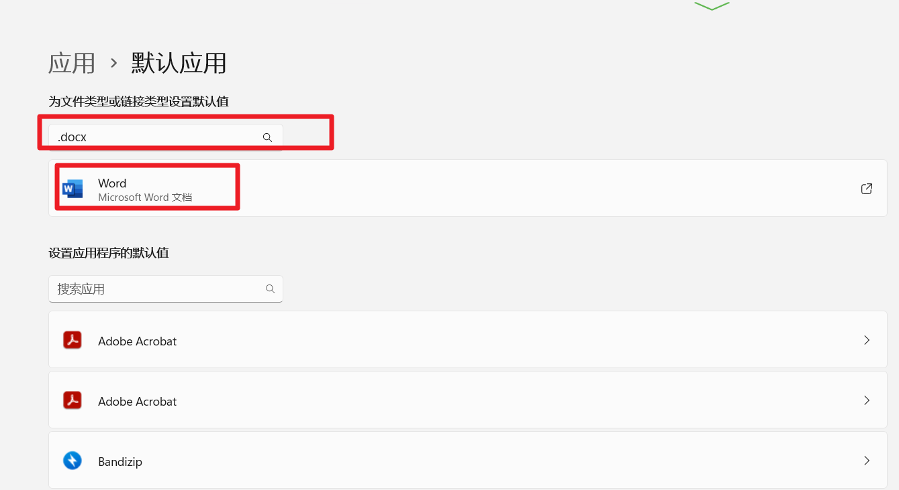
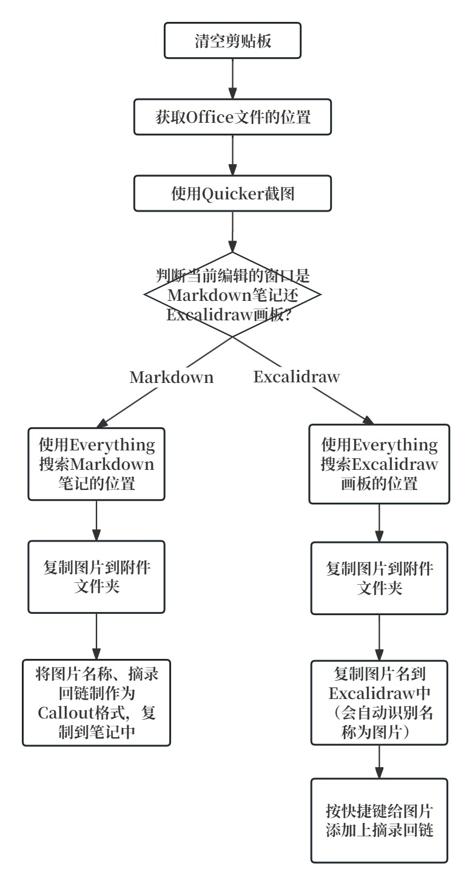
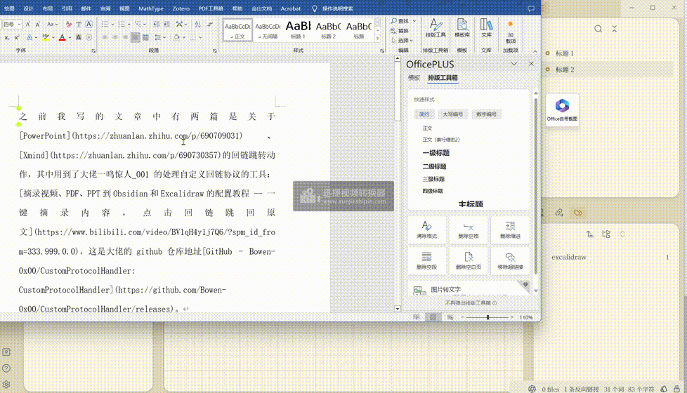
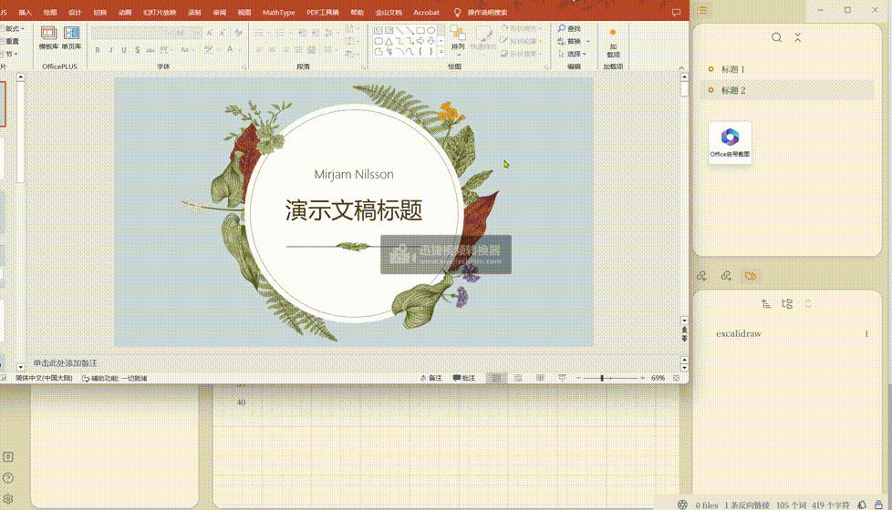
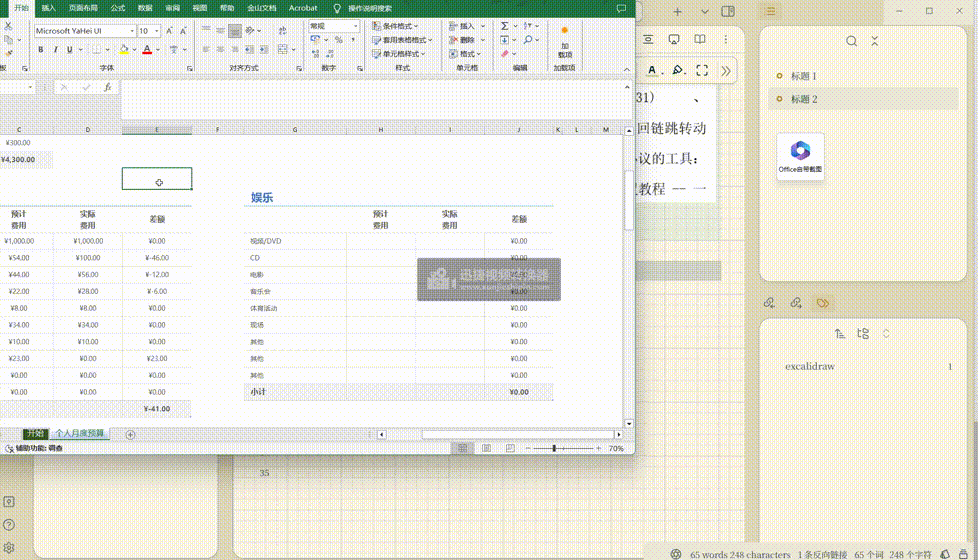
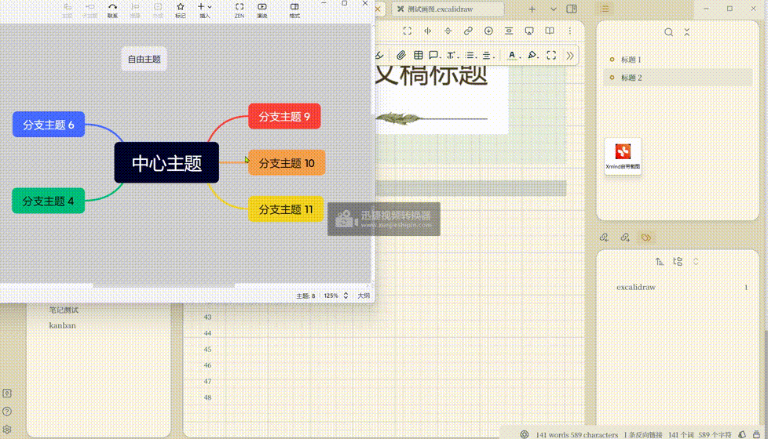

# Office-Xmind

### 另一种实现Word、Excel、PPT跳转回链的思路

#### 灵感来源

之前我写的文章中有两篇是关于[PowerPoint](https://zhuanlan.zhihu.com/p/690709031)、[Xmind](https://zhuanlan.zhihu.com/p/690730357)的回链跳转动作，其中用到了大佬一鸣惊人_001的处理自定义回链协议的工具：[摘录视频、PDF、PPT到Obsidian和Excalidraw的配置教程 -- 一键摘录内容，点击回链跳回原文](https://www.bilibili.com/video/BV1qH4y1j7Q6/?spm_id_from=333.999.0.0)，这是大佬的github仓库地址[GitHub - Bowen-0x00/CustomProtocolHandler: CustomProtocolHandler](https://github.com/Bowen-0x00/CustomProtocolHandler/releases)。

感兴趣可以回看之前的文章。我今天在使用的时候，我就想能不能将**Word、Excel**的内容摘录到Obsidian中，**然后附上链接，点击链接可以打开源Word、Excel文件**。

然后我突然想起我之前写过一篇关于**Markdown链接语法的文章**：[Obsidian、Typora和Logseq的通用Markdown语法](https://zhuanlan.zhihu.com/p/689263713)，其中可以用来链接本地文件，例如：

`[演示文档](<file://C:\Users\Download\演示文档.docx>)`

**点击这个链接就能打开本地的“演示文档.docx”**，路径前面加`file://`是为了在Excalidraw中也能用，加尖括号`<>`是为了防止软件识别不了空格、特殊字符等。

当然，能打开文件的前提是，电脑安装了对应的软件，可以在**系统的设置里看对应文件的默认打开应用是啥**。一般软件安装时，会自动关联，不需要特别注意。下图展示的是`.docx`文件的打开应用，`.xlsx`、`.pptx`、`.xmind`同理。

#### 动作思路

本篇文章中的思路与之前的[PowerPoint](https://zhuanlan.zhihu.com/p/690709031)、[Xmind](https://zhuanlan.zhihu.com/p/690730357)有所不同。第一是**不用写入什么注册表**，因为是直接链接到本地文件的，响应速度更快。第二是**摘录内容的方式不同**，之前是使用VBA宏将PPT中的选中元素，导出为图片，而**现在的是直接使用截图功能**，更方便可靠。

思路是使用Quicker自带的截图功能，截取Word、Excel、PPT中需要摘录的内容，然后找到Obsidian笔记的位置，将图片写入附件文件夹，并在笔记中黏贴上链接。

流程图也很简单：

#### 使用演示

前半段是摘录图片，后半段是点击链接打开文件。

Word演示：

PPT演示：

Excel演示：

上述三者原理都一样，使用的是截图获取图片，有能力的可以用VBA宏获取图片。

Xmind演示：

这里使用的是Quicker自带的截图功能，也可以使用Xmind的快捷键导出图片，感兴趣的朋友可以试试。

#### 两种方式的区别

之前的文章：[PowerPoint](https://zhuanlan.zhihu.com/p/690709031)、[Xmind](https://zhuanlan.zhihu.com/p/690730357)，其中需要将Office、Xmind等软件的安装位置写入注册表。点击笔记中的链接时，回去注册表里找软件的安装位置，并且打开。而现在的方式直接链接到本地文件，使用默认应用打开。

之前的方式的优缺点：

优：理论上可以跳转到源文件的具体位置，比如Word文件的某页、PPT文件的某张幻灯片等。

缺：使用VBA宏导出图片，速度慢，适用性不高。

缺：点击笔记中的链接后相应速度慢。

现在的方式的优缺点：

优：适用Quicker自带的截图功能，速度快，适用性高。

优：点击笔记中的链接后相应速度快。

缺：只能打开源文件，不能跳转到具体的位置。

之前和现在的方式的共同点：

两者都是用绝对路径链接到本地文件，如果源文件移动了位置，或者重命名，那么点击链接将无法打开文件。

我将Quicker动作、不同的摘录情况的调试运行详情放到了[github仓库](https://github.com/operations4304/Office-Xmind)

**但不幸的是，如果您直接用肯定是没法用的**。因为每个人的文件管理方式不同，需要稍微修改。

所以这里提供的是实现的思路，以及可以参考的某些步骤的动作的写法。

如果你对图片的复制方式不清楚，可以查看这篇文章，[附件管理方式](https://zhuanlan.zhihu.com/p/690376509)，介绍了附加的储存情况。

谢谢观看！

